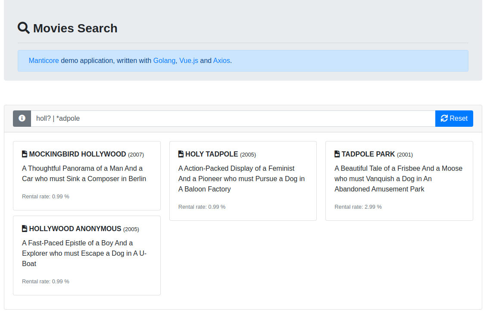

 # Manticore Demo

> [Manticore](https://manticoresearch.com/) movies search demo application, written with [Golang](https://go.dev/), [Vue.js](https://vuejs.org/) and [Axios](https://axios-http.com/).



## Usage

First, start the provided [docker compose stack](docker-compose.yaml)

```shell
docker compose up -d
```

Then, load the sample data (300 movies, persistent volume)

```shell
docker exec -i manticore_demo_manticore mysql < data/movies.sql
```

Finally, you can access the application on [http://localhost:8080](http://localhost:8080]) and [try to search movies](https://manual.manticoresearch.com/Searching/Intro).

## Configuration

You can configure the query mode and the results limit in the [docker-compose.yaml](docker-compose.yaml) file, on the environment variables section:
- `MANTICORE_MODE`: manticore query mode, either `sql` or `json`
- `MANTICORE_LIMIT`: limit of results to return, for example `100`
